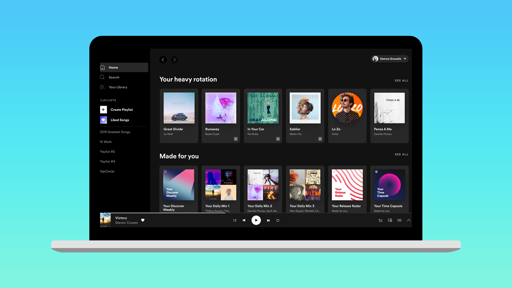

# Information Technologies for Industrial Engineers

## เทคโนโลยีสารสนเทศสำหรับวิศวกรอุตสาหการ

---

- **รหัสกระบวนวิชา**: วศ.อ. 411 (255411)
- **ภาคการศึกษา**: 2567-1
- **ชื่อกระบวนวิชา**:

  - Information Technologies for Industrial Engineers
  - เทคโนโลยีสารสนเทศสำหรับวิศวกรอุตสาหการ

- **อาจารย์**: ผศ.ดร.นิรันดร์ พิสุทธอานนท์

---

# After this class you will be able to

- Describe the landscape of information technology.
  - Web technology (frontend, backend)
  - Artificial intelligence
  - Blockchain
- Develop information system for industrial organizations.
  - Web application
  - AI-powered web application
  - Decentralized application

---

# Past-year apps

- [Cloth-size prediction](https://ie-cloth-size-prediction.netlify.app)
- [Image classification](https://ie-image-classification.netlify.app)
- [Object Detection](https://it-for-ie-test-coco.netlify.app)
- [Speech Regcognition](https://ie-speech.netlify.app)
- [Question and answer](https://ie-qna.netlify.app)
- [Show my blockchain assets](https://nr-blockchain.netlify.app/)

---

| วิธีการประเมินผลการเรียนรู้ | สัดส่วนของการประเมิน |
| :-------------------------: | :------------------: |
|        การสอบกลางภาค        |         20%          |
|        การสอบปลายภาค        |         20%          |
|           Project           |         60%          |

---

# แผนการสอน

- Midterm (Web application)

  - HTML, CSS, JavaScript
  - Web framework (React JS)
  - Database

- Final (Empowering web application)
  - AI
  - Blockchain

---

# Mango Canvas Setup

---

# Web Application....?

---

# Software

- Applications that runs on top of an operating system
  - Windows, MacOS, Linux, Android, iOS
- "Talk" to OSs directly.
- Cannot be used between operation systems.
- Use different technologies/languages
  - C# (Windows), Swift (MacOS, iOS), Kotlin (Android), C++ (Linux)

---

# Web Application

- Applications that execute on a browser (another application) that runs on top of an operating system.
- Does not "talk" to the system directly.
- _Cross platform_
  - "Write once, use anywhere"
- Use similar technogoies/languages
  - HTML, CSS, JavaScript

---

# Types of "Web" Developers

- Front End
- Back End
- Dev Ops
- Full Stack

---

# Web Developer Roadmap

[Do not panic!](https://roadmap.sh/)

---

# Lets get started

---

# Tools

- Web browser
  - Chrome
- Integrated development environment (IDE)
  - VS Code
- _Let's go_

---

# Recommended extensions/settings

- Enable: Format on save
- Extension: Prettier
- Extension: Auto Rename Tag
