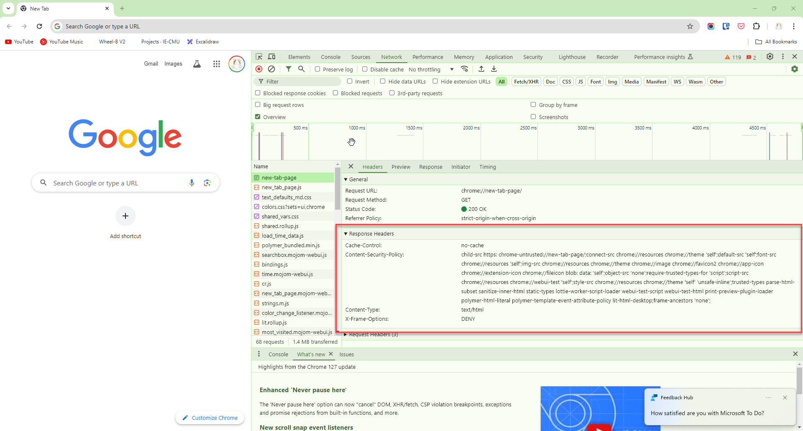
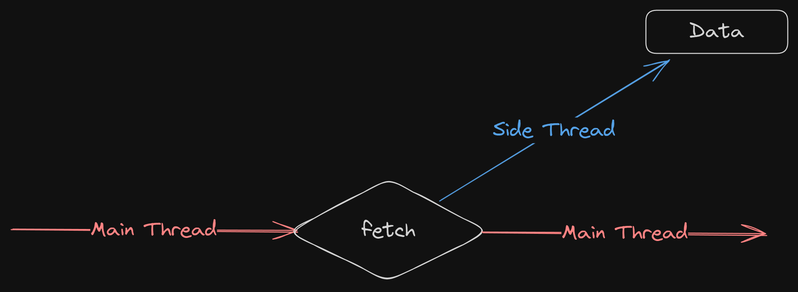

<style>
@import url('https://fonts.googleapis.com/css2?family=Prompt:ital,wght@0,100;0,300;0,400;0,700;1,100;1,300;1,400;1,700&display=swap');

    :root {
    font-family: Prompt;
    --hl-color: #D57E7E;
}
h1 {
  font-family: Prompt
}
</style>

# Information Technologies for Industrial Engineers

## เทคโนโลยีสารสนเทศสำหรับวิศวกรอุตสาหการ

---

# Data Fetching

---

# Get external data

- Let say we want to display this data on our app.
  - https://jsonplaceholder.typicode.com/todos
- You can use `fetch`.

---

# `fetch` API

- The Fetch API is a modern interface that allows you to make HTTP requests to servers from web browsers.
- The `fetch()` method is available in the global scope that instructs the web browsers to send a request to a URL.
- Let's `fetch` information from [JSON Placeholder API](https://jsonplaceholder.typicode.com/todos)

---

# `fetch`

```js
fetch("https://jsonplaceholder.typicode.com/todos");
```

- The `fetch()` method returns a `Promise`.
- But what is a **Promise**?

---

# Note

- If you cannot run console script, it could be because the website have a content security policy header.
- The best way is to create a blank `index.html` and run it yourself.
  

---

# `Promise`

- A `Promise` is an object that represents an intermediate state of an operation.
- `Promise` tells you that a result of some kind will be returned at some point in the future.
- You have to write code that will be executed in order to do something else with a successful result, or to gracefully handle a failure case.
  c

---

# Responding to `Promise`

```javascript
fetch("https://jsonplaceholder.typicode.com/todos")
  .then((res) => {
    return res.json();
  })
  .then((todos) => {
    return console.log(todos);
  });
```

---

# Shorter syntax

```javascript
fetch("https://jsonplaceholder.typicode.com/todos")
  .then((res) => res.json())
  .then((todos) => console.log(todos));
```

---

# Displaying todo titles

```js
fetch("https://jsonplaceholder.typicode.com/todos")
  .then((res) => {
    return res.json();
  })
  .then((todos) => {
    const body = document.body;
    for (let i = 0; i < todos.length; i++) {
      const div = document.createElement("div");
      div.innerText = todos[i].title;
      body.appendChild(div);
    }
  });
```

---

# Note

- Promise creates another execution thread.
- The main thread cannot access data in the side thread.

  

---

# Fetching data in react app

- **Do not** fetch data in the main section of the function.
  - Infinite re-render.
- use `useEffect` function.

---

# Dummy data

- For testing outputting JSX.

```ts
const todos = [
  {
    userId: 1,
    id: 1,
    title: "delectus aut autem",
    completed: false,
  },
  {
    userId: 1,
    id: 2,
    title: "quis ut nam facilis et officia qui",
    completed: false,
  },
];
```

---

# `useEffect`

- Lets you synchronize a component with an external system.

```js
useEffect(() => {
  // Fetching data here
}, []);
```

---

# Code

https://gist.github.com/nnnpooh/7d0fb6e6f798782e945211c92d781626#file-app1-tsx

---

# Send data

- Let's send message to a Line group.

---

# Get Line access token

- https://notify-bot.line.me

---

# Environment variable

`./.env`

```bash
VITE_LINE_TOKEN=....
# Must not have trailing slash
VITE_CORS_PROXY=https://cors.iecmu.com
```

---

# Code

https://gist.github.com/nnnpooh/7d0fb6e6f798782e945211c92d781626#file-app2-tsx

---

```js
fetch(`${CORS_PROXY}/https://notify-api.line.me/api/notify`, {
  method: "POST",
  headers: {
    Authorization: `Bearer ${LINE_TOKEN}`,
    "Content-Type": "application/x-www-form-urlencoded",
  },
  body: new URLSearchParams({
    message: message,
  }),
});
```

---

# Note

- `POST` request
- Use a proxy to send message.
  - [CORS errors](https://developer.mozilla.org/en-US/docs/Web/HTTP/CORS/Errors)
- Use `headers`
- Send content (body) as a URL search parameters.

```js
const usp = new URLSearchParams({ message: "Hello", name: "Tom" });
console.log(usp.toString());
```
