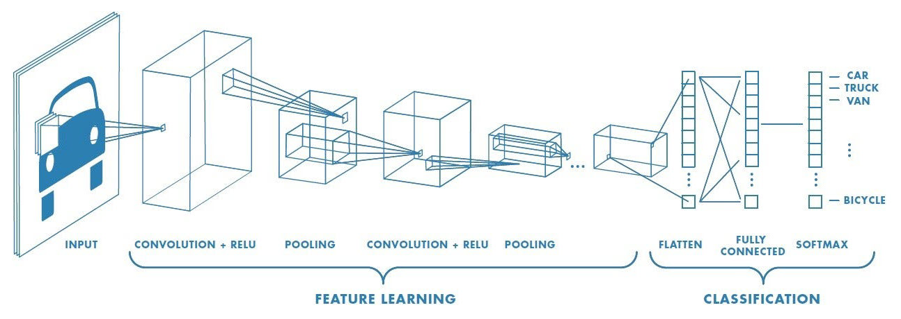
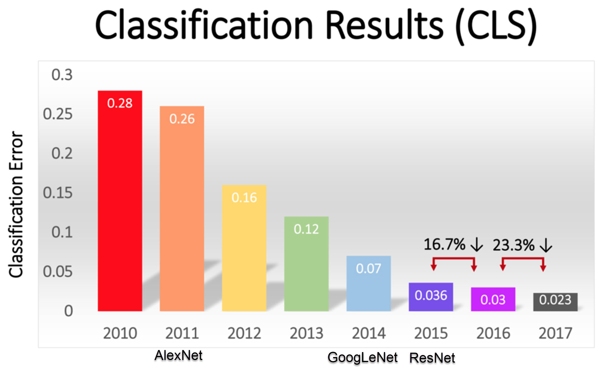

<style>
@import url('https://fonts.googleapis.com/css2?family=Prompt:ital,wght@0,100;0,300;0,400;0,700;1,100;1,300;1,400;1,700&display=swap');

    :root {
    font-family: Prompt;
    --hl-color: #D57E7E;
}
h1 {
  font-family: Prompt
}
</style>

# Information Technologies for Industrial Engineers

## เทคโนโลยีสารสนเทศสำหรับวิศวกรอุตสาหการ

---

# Image Classification Application

---

# Computer vision

- Field of computer science that focuses on enabling computers to identify and understand objects and people in images and videos.
- Computer vision seeks to perform and automate tasks that replicate human capabilities.
  - The way humans see.

---

# Convolutional neural network

- Deep Learning algorithm that can take in an input image and be able to differentiate one from the other.
- The architecture of a `ConvNet` is analogous to that of the connectivity pattern of Neurons in the human brain and the visual cortex.

---



[Source](https://saturncloud.io/blog/a-comprehensive-guide-to-convolutional-neural-networks-the-eli5-way/)

---

# ILSVRC competition

- ImageNet Large Scale Visual Recognition Challenge
  - Started 2010
- Task
  - Evaluates algorithms for object detection and image classification at large scale.
- Data
  - 15 million images
  - 22000 categories

---

## 

---



- Y-axis: Top-5 error
- Exceed human ability @ 2015

---

# Current ranking

https://paperswithcode.com/sota/image-classification-on-imagenet

---

# MobileNet

- MobileNet is a simple but efficient and not very computationally intensive convolutional neural networks for mobile vision applications
- [More info](https://github.com/tensorflow/models/blob/master/research/slim/nets/mobilenet_v1.md)
  

---

# Let's do it

---

# Install

- `npm create vite@latest`
- ...
- `npm install @tensorflow/tfjs`
- `npm install @tensorflow-models/mobilenet`

---

`./src/model.ts`

```ts
import * as tf from "@tensorflow/tfjs";
import * as mobilenet from "@tensorflow-models/mobilenet";

export async function get_model() {
  try {
    // Load mobilenet.
    await tf.ready();
    const model = await mobilenet.load({
      version: 1,
      alpha: 1.0,
    });
    return model;
  } catch (err) {
    console.log(err);
    return null;
  }
}
```

---

`./src/App.tsx`
https://gist.github.com/nnnpooh/03c3ddab0301d111c5629c46d3c00fcf
