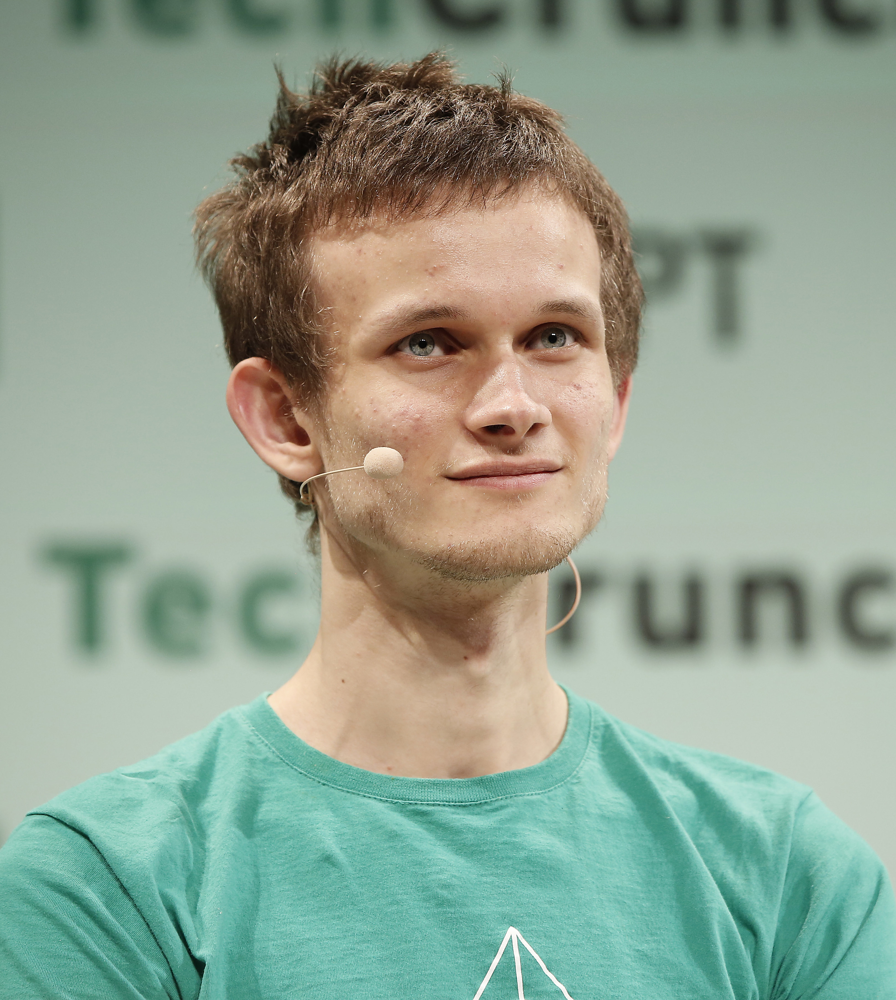

# Information Technologies for Industrial Engineers

## เทคโนโลยีสารสนเทศสำหรับวิศวกรอุตสาหการ

---

# Blockchain

---

# What is blockchain?

---

# Blockchain in engineering applications?

---

# Limitation of blockchain technology?

---

# Blockchain

> Digital trust

---

# Get your hands dirty

- Setup MetaMask
- Get some ETH!
  - https://cloud.google.com/application/web3/faucet/ethereum/sepolia
- Get some LINK!
  - https://docs.chain.link/resources/link-token-contracts

---

# Short history - Bitcoin

- October 31, 2008

  - "[White paper](https://bitcoin.org/bitcoin.pdf)" by _Satoshi Nakamoto_
  - Describing a system to allow peer to peer payments without a financial intermediary (like a bank)

- January 3, 2009
  - The bitcoin network came into existence with Satoshi Nakamoto mining the genesis block of bitcoin (block number 0), which had a reward of 50 bitcoins

---

# Shortcoming

Bitcoin can only be used for sending money.

> Can we use bitcoin technology to transfer other types of exchanges?

---

# Short history - Ethereum

- December 2013
  - "[White paper](https://ethereum.org/en/whitepaper)" by _Vitalik Buterin_
  - Discussing need for more programmatic control over transactions
  - Introducing the idea of _Smart Contracts_ as an entity that can send and receive currency, beyond just humans
- July 2015
  - Birth of Ethereum network

---

# Shortcoming

- Scalability
  - Bitcoin (Layer 1): 7 tps
  - Ethereum (1.0): 30 tps
  - Visa 24,000 tps
- Interoperability
  - Moving token between differnet networks.
- Governance system
  - Bitcoin Foundation and Ethereum Foundation are centralized organization.

[Source](https://www.coindesk.com/learn/cardano-vs-ethereum-can-ada-solve-ethers-problems/)

---

# 3rd-Generation blockchain

[Source](https://medium.com/web3labs/whats-next-for-blockchain-3rd-generation-platforms-a26f34da4d59)

## 

---

# Getting to know blockchain

- [Blockchain demo](https://andersbrownworth.com/blockchain/)
- [Public and private keys](https://andersbrownworth.com/blockchain/public-private-keys/)
- [Block explorer](https://www.blockchain.com/explorer)

### Other cool demos

- [Blockchain demo](https://blockchaindemo.io/)
- [Coin demo](https://coindemo.io/)

---

# Keys

---

# Signature

---

# Getting to know ethereum

- Ethereum networks are used to transfer money and store data
- There are many different [Ethereum networks](https://chainlist.org/).
- Networks are formed by one or more nodes.

---

# Getting to know ethereum

- Each node is a machine running an [ethereum client](https://geth.ethereum.org/).
  - Anyone can run a node.
- Each node can contain a full copy of the blockchain.
  - Stores the record of every transaction that has ever taken place.

---

# Interacting with Ethereum network

MetaMask uses [Infura](https://metamask.zendesk.com/hc/en-us/articles/4417315392795-What-is-Infura-and-why-does-MetaMask-use-it-) node.

---

# Proof of work vs proof of stake

---

[Source](https://www.leewayhertz.com/proof-of-work-vs-proof-of-stake/)

---

# Proof of work

## [Source](https://www.web3labs.com/blockchain-myths)

---

# Proof of stake

## [Source](https://www.web3labs.com/blockchain-myths)

---

| Proof of Work                                  | Proof of Stake                                          |
| ---------------------------------------------- | ------------------------------------------------------- |
| Participating nodes are called miners          | Participating nodes are called validators or forgers    |
| Mining capacity depends on computational power | Validating capacity depends on the stake in the network |
| Mining produces new coins                      | No new coins are formed                                 |
| Miners receive block rewards                   | Validators receive transaction fees                     |
| Massive energy consumption                     | Low to moderate energy consumption                      |
| Significantly prone to 51% attacks             | 51% attacks are virtually impossible                    |

---

# Ethereum merge

- The upgrade from the original proof-of-work mechanism to proof-of-stake was called The Merge.
- The Merge refers to the original Ethereum Mainnet merging with a separate proof-of-stake blockchain called the Beacon Chain, now existing as one chain.
- The Merge reduced Ethereum's energy consumption by ~99.95%.

---

[Source](https://ethereum.org/en/upgrades/merge/)

---

[Source](https://www.coindesk.com/tech/2022/08/24/ethereum-merge-has-an-official-kick-off-date/)

---

# Account

- **Externally-owned account (EOA)** – controlled by anyone with the private keys
- **Contract account** – a smart contract deployed to the network, controlled by code.

---

# Transaction

- An Ethereum transaction refers to an action initiated by an externally-owned account
  - In other words an account managed by a human, not a contract.
- For example, if Bob sends Alice 1 ETH, Bob's account must be debited and Alice's must be credited. This state-changing action takes place within a transaction.

---

# Let's look at a contract

- Send somebody some ETH.
  - If you want, you can send it to me 😊. 0x6269f27234747F4ac12A6d5E88c75e021da290CF
- [Transaction example](https://sepolia.etherscan.io/tx/0x85d5116efbe910d4eeb39696b1637cb573eef619bf4222edfb4df219390dadd6)

---

# How long do we have to wait?

- [Block time](https://etherscan.io/chart/blocktime)

- [Details](https://medium.com/stakefish/deeper-dive-into-ethereum-2-0-part-1-93c475a18735)

---

# Gas

> Gas fees help keep the Ethereum network secure. By requiring a fee for every computation executed on the network, we prevent bad actors from spamming the network.

---

# Gas

- Gas refers to the unit that measures the amount of computational effort required to execute specific operations on the Ethereum network.
- Gas fees are paid in ether `ETH`.
- Unit of gas is `gwei`.

  - 1 `gwei` = 0.000000001 `ETH` (10^-9 `ETH`).

- Gas limit

  - Maximum amount of gas you are willing to consume on a transaction.
  - A standard ETH transfer requires a gas limit of 21,000 `gwei`.

---

# Gas information

- https://etherscan.io/gastracker
