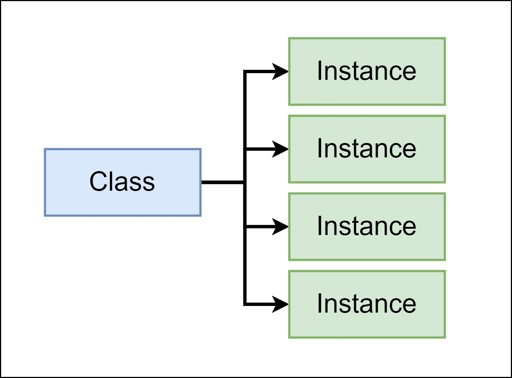

<style>
@import url('https://fonts.googleapis.com/css2?family=Prompt:ital,wght@0,100;0,300;0,400;0,700;1,100;1,300;1,400;1,700&display=swap');

    :root {
    font-family: Prompt;
    --hl-color: #D57E7E;
}
h1 {
  font-family: Prompt
}
</style>

# Information Technologies for Industrial Engineers

## เทคโนโลยีสารสนเทศสำหรับวิศวกรอุตสาหการ

---

# Smart contract

- A smart contact is an account controlled by code.
- The code instructs the account how to behave.
  

---

| Field   | Description                                        |
| ------- | -------------------------------------------------- |
| Balance | Amount of ether this accoun owns. (Similar to EOA) |
| Storage | Data storage for this contract                     |
| Code    | Raw machine code for this contract                 |

---

# Contract account deployment

- A particular EOA is valid in all networks.
- CA is locally available in the deployed network.


---

# Contract account deployment

- We write source code.
- We deploy contract to a network.
  - Create an _instance_ of a contract (or **contract account**)
- There can be multiple instance of a contract.


---

# Class



---

# Solidity programming language

- Language that we will use to write the source code of a smart contract.
- Written in `.sol` files
- Strongly typed

---

# Workflow


---

# ABI

- Application Binary Inteface
- Defines the structures and methods to interact with the binary contract.


---

# JavaScript VM

- A simulated Blockchain Environment that only exists in your browser.
- It also only exists as long as you keep the browser-tab open. Close it or reload it, you start from scratch.
- Many versions
  - Cancun (Latest)
  - Shanghai

---

# Let's code

https://remix.ethereum.org/

---

# Love Letter

```js
// SPDX-License-Identifier: GPL-3.0

pragma solidity >=0.8.2 <0.9.0;

/**
 * @title LoveLetter
 * @dev Store love confession
 */
contract LoveLetter {

    string public secret;

    /**
     * @dev Initialize
     * @param _secret to initialize
     */
    constructor(string memory _secret) {
        secret = _secret;
    }

    /**
     * @dev Store value in variable
     * @param _secret to store
     */
    function changeSecret(string memory _secret) public {
        secret = _secret;
    }
}

```
