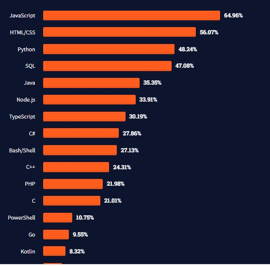

<style>
@import url('https://fonts.googleapis.com/css2?family=Prompt:ital,wght@0,100;0,300;0,400;0,700;1,100;1,300;1,400;1,700&display=swap');

    :root {
    font-family: Prompt;
    --hl-color: #D57E7E;
}
h1 {
  font-family: Prompt
}
</style>

# Information Technologies for Industrial Engineers

## เทคโนโลยีสารสนเทศสำหรับวิศวกรอุตสาหการ

---

# JavaScript

- JavaScript is the Programming Language for the Web
- Can be used on server-side
  - `Node.js`
- [Image Source](https://www.devopsschool.com/blog/top-popular-programming-languages-in-2022-by-stackoverflow-ranking/)



---

# TypeScript

- TypeScript is a syntactic superset of JavaScript which adds static typing.
- It shares the same base syntax as JavaScript, but adds something to it.
- _Much beter than JavaScript, trust me._

---

# Initializing a variable

```js
let myName = "Me";
const yourName = "You";
```

---

# Variable types

```js
const numberType = 1;
const stringType = "This is a string";
const booleanType = true;
const undefinedType = undefined;
const nullType = null;
const arrayType = [1, 2, 3];
const objectType = { key1: 1, key2: "two" };
```

To check type

```js
console.log(typeof numberType);
```

---

# Function

```js
// Function
function hello1(name: string) {
  console.log("Hello " + name);
}

// Arrow function
const hello2 = (name: string) => {
  console.log("Hello " + name);
};

// Calling
hello1("Ari");
hello2("Tom");
```

---

# `if` - `else if` - `else`

```javascript
let choice = "A"; // 'A', 'B', 'C'

if (choice === "A") {
  console.log("You chose A.");
} else if (choice === "B") {
  console.log("You chose B.");
} else if (choice === "C") {
  console.log("You chose C.");
} else {
  console.log("You did not choose A, B, or C.");
}
```

---

# Looping code

- Print 10 random numbers

```javascript
for (let i = 0; i < 10; i++) {
  console.log(Math.random()); // 10 randoms numbers
}
```

---

# Looping through an array

```javascript
const cats = ["Leopard", "Serval", "Jaguar", "Tiger", "Caracal", "Lion"];

for (const cat of cats) {
  console.log(cat);
}
```
