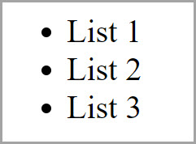
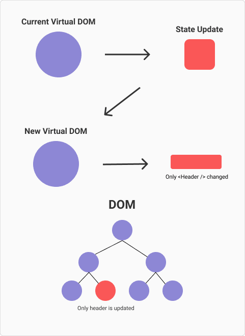
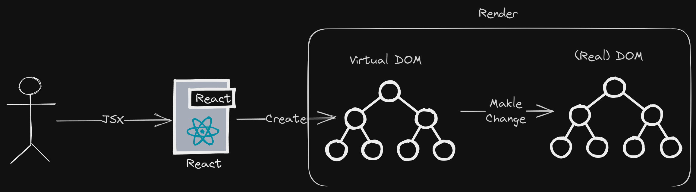

<style>
@import url('https://fonts.googleapis.com/css2?family=Prompt:ital,wght@0,100;0,300;0,400;0,700;1,100;1,300;1,400;1,700&display=swap');

    :root {
    font-family: Prompt;
    --hl-color: #D57E7E;
}
h1 {
  font-family: Prompt
}
</style>

# Information Technologies for Industrial Engineers

## เทคโนโลยีสารสนเทศสำหรับวิศวกรอุตสาหการ

---

# JavaScript Frameworks

---

# What is a framework?

- A framework is a library that offers **opinions** about how software gets built.
- These opinions allow for **predictability** and **homogeneity** in an application.
  - Predictability allows software to scale to an enormous size and still be maintainable.
  - Predictability and maintainability are essential for the health and longevity of software.

---

# Imperative and declarative programming

- **Imperative**
  - Tell a computer how to do something.
- **Declarative**
  - Describe to a computer what you want.

---

# To do this



---

# Imperative programming

- JavaScript

```javascript
const ul = document.createElement("ul");
for (let i = 1; i < 4; i++) {
  const li = document.createElement("li");
  li.textContent = `List ${i}`;
  ul.appendChild(li);
}
document.body.appendChild(ul);
```

---

# Declarative

- Just use HTML

```html
<ul>
  <li>List 1</li>
  <li>List 2</li>
  <li>List 3</li>
</ul>
```

---

# But...

- `HTML` only works for static site.
- For dynamic web application, a **framework** can help us write code more **declaratively**.

---

# Vanilla JS or Framework?

- Vanilla JS
  - A less complex site, for example a personal to-do list or a site that displays mostly static content
- Framework
  - A large site with a complex UI. Frameworks provide solutions to common problems that would take an absurd amount of time and patience to implement with pure JavaScript.

---

# Stack-Overflow survey 2023

https://survey.stackoverflow.co/2023/#section-most-popular-technologies-web-frameworks-and-technologies

---

# React

---

# JSX

```jsx
const element = <h1>Hello, world!</h1>;
```

- This is neither a string nor HTML.
- It is called JSX, and it is a syntax extension to JavaScript. - - This tells React to describe what the UI should look like.
- JSX produces React "elements".
- [Source](https://react.dev/learn/writing-markup-with-jsx)

---

# Virtual DOM

- Virtual DOM (VDOM) represents the DOM tree in memory.
- VDOM performs calculations and decides which elements of the actual DOM should be mutated.
  - Faster performance.
- [Source](https://dev.to/teo_garcia/understanding-rendering-in-react-i5i)



---

## 

---

# Rendering process

- Rendering is a process that is triggered by a change of state in some component of your application, when a state change occurs React.
- See illustration in [Source](https://dev.to/teo_garcia/understanding-rendering-in-react-i5i).

---

## 

---

# Get started with `react`

- `npm create vite@latest`
  - `Project name`: my-app (any name)
  - `Select a framework`: React
  - `Select a variant`: Typescsript + SWC
- `cd my-app`
- `npm run dev`

---

# Build

- `npm run build`

# Preview

- `npm run preview`

---

# Optional

- If you want to preview the build with `live server` you need to set this setting in `vite.config.ts`.

```js
export default defineConfig({
  plugins: [react()],
  base: "./", 👈
});
```

- Then run `npm run build`.

---

# Deploy

- Deploy `./dist` folder to Netlify.

---

# Online IDE

- https://stackblitz.com/
- https://codesandbox.io/
