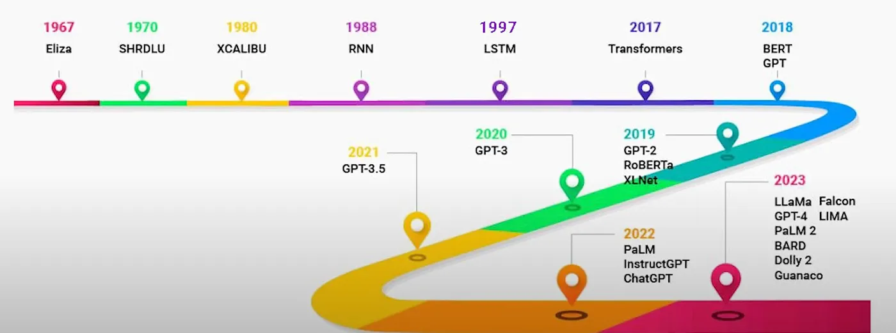
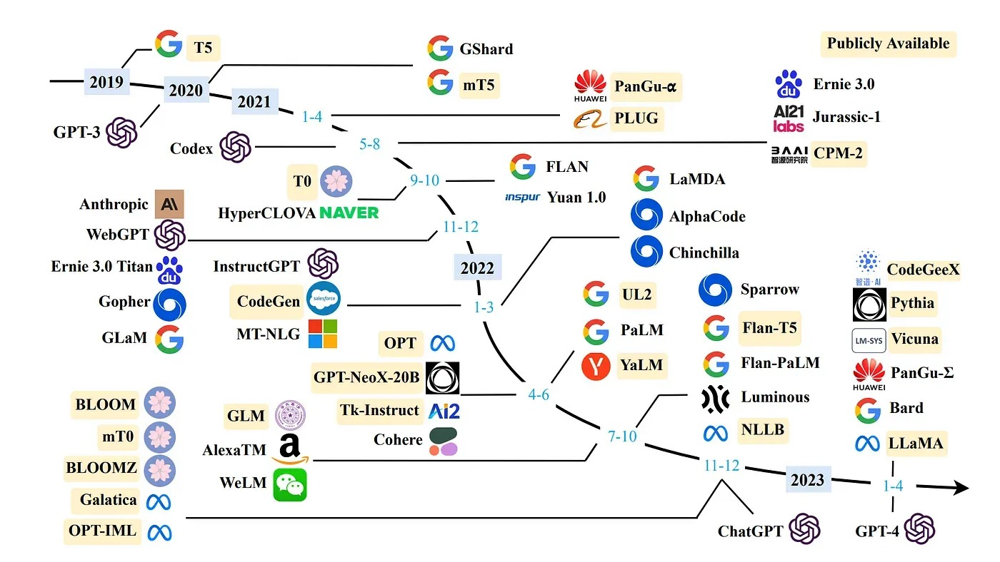
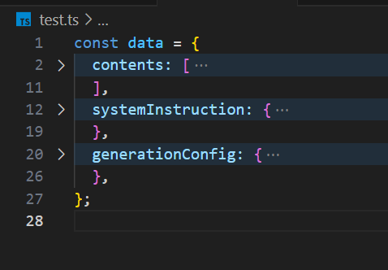

<style>
@import url('https://fonts.googleapis.com/css2?family=Prompt:ital,wght@0,100;0,300;0,400;0,700;1,100;1,300;1,400;1,700&display=swap');

    :root {
    font-family: Prompt;
    --hl-color: #D57E7E;
}
h1 {
  font-family: Prompt
}
</style>

# Information Technologies for Industrial Engineers

## เทคโนโลยีสารสนเทศสำหรับวิศวกรอุตสาหการ

---

# Large language model (LLM)

---

# LLM

- A type of advanced software that can communicate in a human-like manner.
- General-purpose language processing models
  - Pre-trained on extensive datasets covering a wide range of topics.
  - Understand the fundamental structures and semantics of human language.
- `Large`
  - Substantial amount training data
  - Billions or even trillions of parameters

---



---

# Chatbots and rule-based systems (1960s)

- `ELIZA`
  - The first chatbot ever built by humans.
- It can create an illusion of a conversation
  - by rephrasing user statements as questions using pattern matching and substitution methodology.
- [Try it.](https://web.njit.edu/~ronkowit/eliza.html)

---

# Recurrent Neural Networks (1980s)

- Neural networks that can "remember" previous input.
  - Using feedback loop.
- Suitable for natural language processing (NLP) tasks.
- Still, they are not good at retaining memory and suffer from long term memory loss.
  - Vanishing gradient.

---

# Long Short Term Memory (1990s)

- Specialised type of RNN.
- Can remember information over long sequences.
- LSTM architecture
  - `input`, `forget`, `output` gates
  - These gates determined how much information should be memorised, discarded, or output at each step.

---

# Gated Recurrent Network (2010s)

- Designed to solve some of the same problems as LSTMs
  - but with a simple and more streamlined structure.
- GRUs architecture
  - `update` and `reset` gate
  - The reduced gating in GRUs made them more efficient in terms of computation.

---

# Attention Mechanism (2014)

- RNN based variants LSTM and GRU are not great at retaining the context when it was far away.
- Attention allows the model to look back to the entire source sequence dynamically
  - Selecting different parts based on their relevance at each step of the output.
- Performs much better especially in longer sequences.

---

# Transformers Architecture (2017)

- Architechture based on attention mechanism.
  - Stacked layers of (self) attention and feed-forward neural networks.
  - _Multi-head_ attention
- Can focus on different parts of the input sentence simultaneously, capturing various contextual nuances.
- Can sequences in parallel rather than sequentially.
- Foundation for a new era of LLMs.
  - `GPT` ➡️ _Generative Pre-Trained Transformer_

---

# Large Language Models (2018-onwards)

- Scaling...

---



---

# Let's use LLM.

> Google Gimini

---

# Setup

- Create a project in [Google Cloud Platform](https://cloud.google.com)
- Generate an API kep in [Google AI Studio](https://aistudio.google.com)

---

# Selecting a model

- [Gemini Model Comparison](https://medium.com/@daniellefranca96/gemini-1-5-flash-vs-gemini-1-5-pro-how-the-model-really-performs-9d39ffce9d46)

---

# Building model prompt

- Let's build an email generator for students who want to write to their advisors.
- `System Instructions`
  - The writer is a female student. The tone should be formal.
- `Prompt`
  - Write an email to the advisor in Thai. The topic is [ขอพบ วันจันทร์ นี้ ตอน 10 โมง ว่างมั้ย อยากปรึกษาเรื่องโปรเจค].
- Adjust `temperature` for more randomness.

---

# Copy code

- Click `Get Code`.
- Choose `cURL`.
- Copy the content and save it somewhere.

---

# Setup vite project

- `npm create vite@latest`
- `cd vite-prject`
- `code . -r`
- `npm install`

---

# Format your prompt

- Create a dummy file (`test.ts`).
- Paste the generated code.
- Format the code.



---

# Environment variable

`./.env`

```ts
VITE_GEMINI_API_KEY=...
```

---

# Code

https://gist.github.com/nnnpooh/cd11f37067f31e34962717efb88fdfdb
