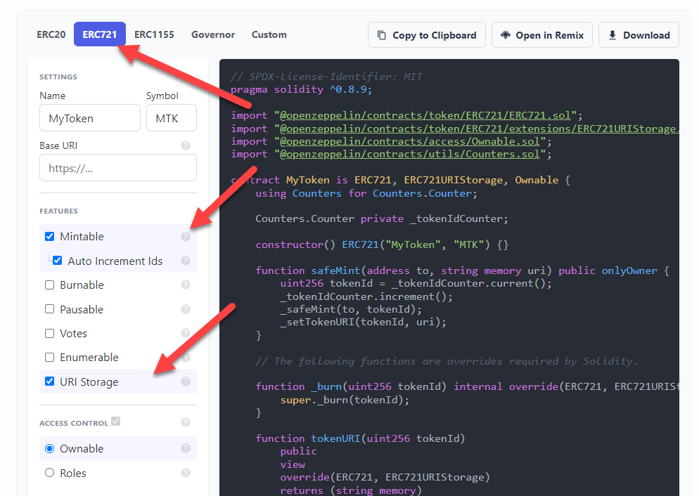

<style>
@import url('https://fonts.googleapis.com/css2?family=Prompt:ital,wght@0,100;0,300;0,400;0,700;1,100;1,300;1,400;1,700&display=swap');

    :root {
    font-family: Prompt;
    --hl-color: #D57E7E;
}
h1 {
  font-family: Prompt
}
</style>

# Information Technologies for Industrial Engineers

## เทคโนโลยีสารสนเทศสำหรับวิศวกรอุตสาหการ

---

# Smart contract applications

---

# Decentralized lottery

---

# Decentralized lottery

- [Code](https://gist.github.com/nnnpooh/ea23ffda5f7f74dd6a6d46afb7b03ed3#file-lottery-sol)

- [Unit converter](https://coinguides.org/ethereum-unit-converter-gwei-ether/)

---

# ERC Token

---

# What is a token?

- Something of value
  - Currency
  - Voting right
  - Stock
- Token standard
  - EIP (_Ethereum Improvement Proposal_)
    - Guideline
  - ERC (_Ethereum Request for Comments_)
    - Implementation

---

# Popular token standards

- **ERC-20**
  - Fungible tokens
  - Most used for representing currency
- **ERC-721**
  - Non-fungible tokens (NFTs)
  - Most used for representing digital artwork and collectibles
- **ERC-1155**
  - Multi-token standard
  - Combining the abilities of ERC-20 and ERC-720

---

# Timeline


[Source](https://www.leewayhertz.com/erc-20-vs-erc-721-vs-erc-1155/)

---

# Token list

- https://etherscan.io/tokens

---

# Let's make your own ERC-20 token.

- [Contract generator](https://wizard.openzeppelin.com)

- [Source code](https://github.com/OpenZeppelin/openzeppelin-contracts/blob/master/contracts/token/ERC20/ERC20.sol)

---

# IPFS

## Interplanetary File System

---

# Decentralized data storage

- DApps need to store/retrieve data in a decentralized manner.
- Saving data in the blockchain is very expensive.
- We need to save data **off-chain**.

---

# IPFS

- _Interplanetary File System_
  - Decentralized off-chain solution for data storage.
- When we put data on IPFS, we obtain **content identifier (CID)** that uniquely indentifies the data.
  - For example, `QmTHUf5DiynRc5WRJBMcZYtigmWqkdtJVxuQVKoAjMPnoB`
  - We store CID on the ethereum block chain.
- Note: `Swarm` is an alternative to IPFS.

---

# IPFS

- Aims to replace HTTP.
- Peer-to-peer (based on bit-torrent)
  - Network consists of multiple _nodes_.
- Data is permanent and cannot be deleted or modified
  - Data are already distributed to other nodes.

---

# Content/Location addressing

- **Location addressing**

  - `https://cmu.ac.th/file.pdf`
  - Who ever controls that location control the content.

- **Content addressing**
  - Files are based on **where they are**, but on **what they are**.
  - There is no location of the files.
  - No one controls the files.

---

# Pinning

- Mechanism that allows IPFS to always keep a given content and never remove it.

---

# Pinata

- IPFS pinning service.
- https://www.pinata.cloud/

---

# Gateway

- Allows browsers to access IPFS.
- **Local gateway** (need to run IPFS client)
  - `http://localhost:8080/ipfs/[CID]` [(ex)](http://localhost:8080/ipfs/QmTHUf5DiynRc5WRJBMcZYtigmWqkdtJVxuQVKoAjMPnoB)
- **Private gateway**
- **Public gateway**
  - `https://ipfs.io/ipfs/[CID]` [(ex)](https://ipfs.io/ipfs/QmTHUf5DiynRc5WRJBMcZYtigmWqkdtJVxuQVKoAjMPnoB)
  - `https://gateway.pinata.cloud/ipfs/[CID]` [(ex)](https://gateway.pinata.cloud/ipfs/QmTHUf5DiynRc5WRJBMcZYtigmWqkdtJVxuQVKoAjMPnoB)

---

# Non-Fungible Token (NFT)

---

# Non-Fungible Token (NFT)?

- Cryptographic assets on a blockchain with unique identification codes and metadata that distinguish them from each other.
- Cannot be traded or exchanged at equivalency.
- NFTs can represent real-world items like artwork and real estate.

---

# Hype?


---

# Standard

- ERC-721 standard
  - Most common
- The ERC-1155 standard takes the concept further.
  - Reducing the transaction and storage costs required for NFTs.
  - Natching multiple types of non-fungible tokens into a single contract.

---

# NFTs in action

- [CLOAKS #19345](https://opensea.io/assets/ethereum/0x0c56f29b8d90eea71d57cadeb3216b4ef7494abc/19345)

  - [Contract](https://etherscan.io/address/0x0c56f29b8d90eea71d57cadeb3216b4ef7494abc)

  - [Token URI](https://ipfs.io/ipfs/QmSzn68idqk4ATRVjoToXSc6wLcxmkGMDWCyvcHvz1Ue8U/19345)

  - [Image](https://ipfs.io/ipfs/QmNQqjB8J9X4KZizrgsrhuGHWaR9vt33R5eKoiSFT7gB3o)

---

Another Contract

- [re:gen #884](https://opensea.io/assets/base/0x56dfe6ae26bf3043dc8fdf33bf739b4ff4b3bc4a/884)

  - This contract hosts url in a regular server (😲).

---

# Create your own NFTs (simple)

[OpenSea Testnet](https://testnets.opensea.io/)

---

# Implementing ERC721

- [OpenZeppelin](https://wizard.openzeppelin.com/#erc721)



---

# Create your own NFTs (Custom)

1. **Create image**
2. **Upload to IPFS**
   2.1 Get `image_url`
3. **Create metadata**
   3.1 Save as `JSON` file
4. **Upload metadata file to IPFS**
   4.1 Get `token_uri`
5. **Deploy contract**
6. **Mint token**

---

Metadata

```json
{
  "name": "<<name>>",
  "description": "<<description>>",
  "external_url": "<<external_link>>",
  "image": "<<image_url>>",
  "attributes": [
    {
      "trait_type": "Personality",
      "value": "Sad"
    },
    {
      "trait_type": "Level",
      "value": 5
    },
    {
      "display_type": "boost_number",
      "trait_type": "Power",
      "value": 40
    }
  ]
}
```
